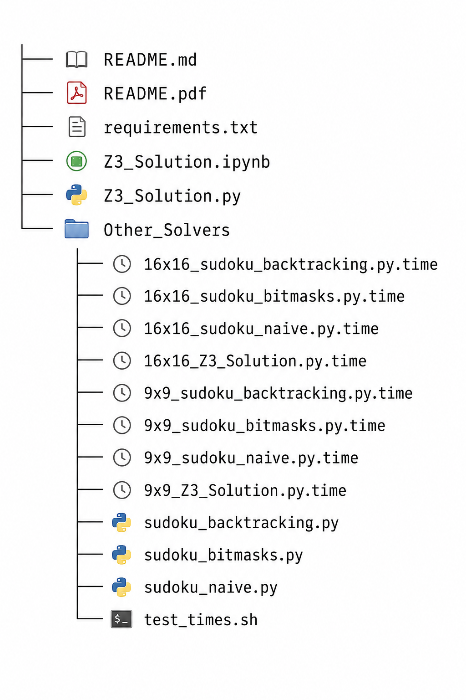

# CS-557 Network Verification & Synthesis, Spring 2023

## Project: Z3-Sudoku

### Files in archive
The following files are included in this archive:  

| File                   | Description                                                                                                                                                                                                                                      |
|------------------------|--------------------------------------------------------------------------------------------------------------------------------------------------------------------------------------------------------------------------------------------------|
| README.md              | This README file as a Markdown file                                                                                                                                                                                                              |
| README.pdf             | This README file as a PDF file                                                                                                                                                                                                                   |
| requirements.txt       | Used by `pip` to install the Z3 solver and NumPy                                                                                                                                                                                                 |
| Z3_Solution.ipynb      | The Sudoku Z3 solution in a Jupyter Notebook                                                                                                                                                                                                     |
| Z3_Solution.py         | The Sudoku Z3 solution in a Python file                                                                                                                                                                                                          |
| 16x16_*.time           | The execution time of all 4 Sudoku algorithms on a 16x16 puzzle, generated by test_times.sh                                                                                                                                                      |
| 9x9_*.time             | The execution time of all 4 Sudoku algorithms on a 9x9 puzzle, generated by test_times.sh                                                                                                                                                        |
| sudoku_backtracking.py | A Sudoku Back Tracking algorithm                                                                                                                                                                                                                 |
| sudoku_bitmasks.py     | A Sudoku Back Tracking with Bit Masks algorithm                                                                                                                                                                                                  |
| sudoku_naive.py        | A Sudoku Naive algorithm                                                                                                                                                                                                                         |
| test_times.sh          | Runs all the Python files (only the ones with extension `.py`) in batch and generate the execution time in milliseconds. Takes a required parameter, a string to prepend to each Python file and appends the string `.time` to each output file. |

While a Jupyter Notebook file has been included (`Z3_Solution.ipynb`), it is not meant to be run.  It includes additional markdown cells with stylized comments.  The original source code in the Jupyter notebook can be found in the `Z3_Solution.py` file.  This solution is meant to run only the Python scripts with extension `.py`.

## Changing the Sudoku puzzle size

| File                                                                      | How to change the puzzle size                                                                        |
|---------------------------------------------------------------------------|------------------------------------------------------------------------------------------------------|
| `Z3_Solution.py`                                                          | Set the variable `puzzle` to `grid_9x9` for the 9x9 puzzle, or to `grid_16x16` for the 16x16 puzzle. |
| `sudoku_naive.py`,  `sudoku_bitmasks.py`,  `sudoku_backtracking.py` | Set the variable `grid` to `grid_9x9` for the 9x9 puzzle, or to `grid_16x16` for the 16x16 puzzle.   |

## Running the solution
The solution can be run using Virtual Environment (`virtualenv`) or using Anaconda.

### Using virtualenv
**Pre-requisites**: virtualenv and Python (3.10.6 or higher).  

Run the following commands in a terminal:
| Command                           | Description                            |
|-----------------------------------|----------------------------------------|
| `virtualenv Z3_Sudoku`            | Create a new virtual environment named |
| `source Z3_Sudoku/bin/activate`   | Activate the new environment           |
| `pip install -r requirements.txt` | Install the required modules           |
| `python3 Z3_Solution.py`          | Run the solution &#10070;              |

### Using Anaconda
**Pre-requisites**: Anaconda (2023.3 or higher) and Python (3.10.6 or higher).  

Run the following commands in a terminal:  
| Command                           | Description                    |
|-----------------------------------|--------------------------------|
| `conda create --name Z3_Sudoku`   | Create a new conda environment |
| `conda activate Z3_Zudoku`        | Activate the new environment   |
| `pip install -r requirements.txt` | Install the required modules   |
| `python3 Z3_Solution.py`          | Run the solution &#10070;      |

&#10070; If `python3` does not work on your system, the executable might have been symlink to `python` instead of `python3`.
